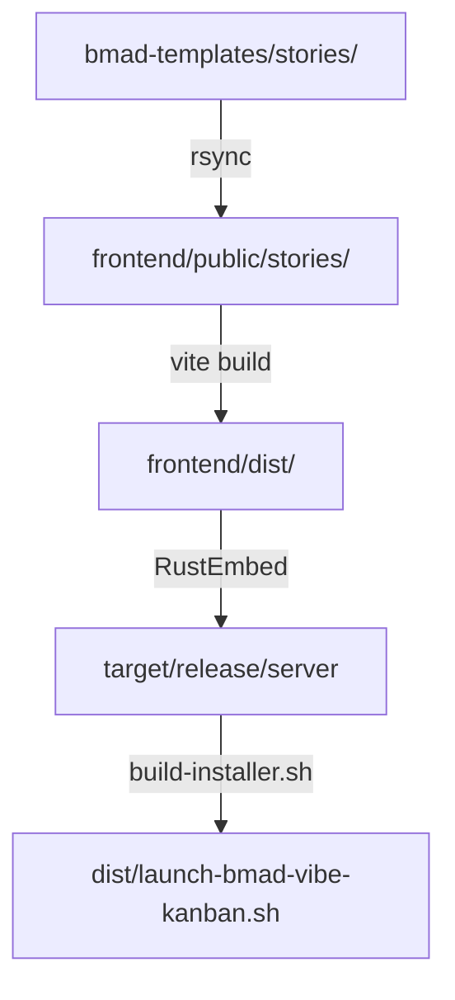

# BMAD-Vibe-Kanban Documentation Index

Complete documentation for the BMAD-Vibe-Kanban project - a fork of Vibe Kanban 0.1.4 with integrated BMAD methodology.

## Documentation Structure

Documentation is organized into three main areas:

- **[docs-vibe-kanban/](./docs-vibe-kanban/)** - Vibe Kanban technical documentation
- **[docs-bmad/](./docs-bmad/)** - BMAD methodology and stories
- **[docs-integration/](./docs-integration/)** - Fork and integration documentation

Each section has its own README for detailed navigation.

## Quick Start

- **[README.md](./README.md)** - Project overview, quick start guide, and license information

## Vibe Kanban Documentation

### Build & Development
- **[docs-vibe-kanban/BUILD-GUIDE.md](./docs-vibe-kanban/BUILD-GUIDE.md)** - Complete build documentation
  - Story sync workflow
  - Frontend and backend build process
  - Installer creation
  - Troubleshooting guide
  - CI/CD integration examples
- **[docs-vibe-kanban/AGENTS.md](./docs-vibe-kanban/AGENTS.md)** - Development guidelines and build commands
- **[docs-vibe-kanban/development-guide.md](./docs-vibe-kanban/development-guide.md)** - Developer setup and workflow
- **[docs-vibe-kanban/CLAUDE-VERIFICATION-GUIDE.md](./docs-vibe-kanban/CLAUDE-VERIFICATION-GUIDE.md)** - Quick reference for Claude Code verification

### Testing
- **[docs-vibe-kanban/TESTING-CHECKLIST.md](./docs-vibe-kanban/TESTING-CHECKLIST.md)** - Complete testing guide (6 phases)

### Architecture
- **[docs-vibe-kanban/architecture.md](./docs-vibe-kanban/architecture.md)** - Vibe Kanban system architecture
- **[docs-vibe-kanban/component-inventory.md](./docs-vibe-kanban/component-inventory.md)** - Component inventory and structure
- **[docs-vibe-kanban/source-tree-analysis.md](./docs-vibe-kanban/source-tree-analysis.md)** - Source tree analysis
- **[docs-vibe-kanban/api-contracts.md](./docs-vibe-kanban/api-contracts.md)** - API contracts and interfaces
- **[docs-vibe-kanban/data-models.md](./docs-vibe-kanban/data-models.md)** - Data models and schemas
- **[docs-vibe-kanban/project-overview.md](./docs-vibe-kanban/project-overview.md)** - Project technical overview

## BMAD Documentation

### Methodology & Philosophy
- **[docs-bmad/methodology/00-BMAD-TEA-MASTER-GUIDE.md](./docs-bmad/methodology/00-BMAD-TEA-MASTER-GUIDE.md)** - BMAD methodology master guide
- **[docs-bmad/methodology/01-WORKFLOW-PHASES-COMPLETE.md](./docs-bmad/methodology/01-WORKFLOW-PHASES-COMPLETE.md)** - Complete workflow phases specification
  - Philosophy of BMAD stories
  - Wave-Epic-Story (WES) structure
  - Workflow execution model
- **[docs-bmad/methodology/03-GUIDE-CHOIX-WORKFLOW.md](./docs-bmad/methodology/03-GUIDE-CHOIX-WORKFLOW.md)** - Workflow selection guide
- **[docs-bmad/methodology/traceability-matrix.md](./docs-bmad/methodology/traceability-matrix.md)** - Story traceability matrix

### Story Workflows

BMAD includes 4 pre-built workflows with 40 total stories:

| Workflow | Location | Stories | Purpose |
|----------|----------|---------|---------|
| **workflow-complet** | [bmad-templates/stories/workflow-complet/](./bmad-templates/stories/workflow-complet/) | 18 | Complete product development (ideation → deployment) |
| **document-project** | [bmad-templates/stories/document-project/](./bmad-templates/stories/document-project/) | 10 | Documentation-first approach for existing codebases |
| **quick-flow** | [bmad-templates/stories/quick-flow/](./bmad-templates/stories/quick-flow/) | 4 | Fast feature development workflow |
| **debug** | [bmad-templates/stories/debug/](./bmad-templates/stories/debug/) | 7 | Bug investigation and resolution workflow |

### BMAD Tools
- **[docs-bmad/tools/WORKFLOW-SYNC-TOOL.md](./docs-bmad/tools/WORKFLOW-SYNC-TOOL.md)** - Workflow ↔ Story synchronization analyzer
  - Semantic analysis using LLM (GPT-4, Claude)
  - Identifies stories to delete, modify, or add
  - SHA256 checksum-based cache system
  - Detailed usage guide and troubleshooting
- **[tools/workflow-sync/README.md](./tools/workflow-sync/README.md)** - Quick reference for workflow sync tool

## Fork & Integration Documentation

### Fork Information
- **[docs-integration/FORK.md](./docs-integration/FORK.md)** - Fork relationship with upstream Vibe Kanban
  - Syncing strategy
  - Version numbering
  - Upstream compatibility
- **[docs-integration/FORK-RESTORATION.md](./docs-integration/FORK-RESTORATION.md)** - Fork restoration to v0.1.4
- **[docs-integration/PRIVACY-VERIFICATION.md](./docs-integration/PRIVACY-VERIFICATION.md)** - Privacy audit report (Discord/external API removal)
- **[docs-vibe-kanban/fork-history/MODIFICATION_FORK.md](./docs-vibe-kanban/fork-history/MODIFICATION_FORK.md)** - Detailed modifications log

### Integration Architecture
- **[docs-integration/integration-architecture.md](./docs-integration/integration-architecture.md)** - BMAD-Vibe Kanban integration architecture
  - Component interactions
  - Data flow
  - Story embedding mechanism

### Build Process Documentation
- **[docs-integration/build-process/BUILD-SYNC-BEHAVIOR.md](./docs-integration/build-process/BUILD-SYNC-BEHAVIOR.md)** - Story synchronization mechanism
- **[docs-integration/build-process/INSTALLER-BUILD-FLOW.md](./docs-integration/build-process/INSTALLER-BUILD-FLOW.md)** - Installer build workflow
- **[docs-integration/build-process/INSTALLER-VS-DIRECT-BINARY.md](./docs-integration/build-process/INSTALLER-VS-DIRECT-BINARY.md)** - Behavioral differences
- **[docs-integration/build-process/INSTALLER-FIX-SUMMARY.md](./docs-integration/build-process/INSTALLER-FIX-SUMMARY.md)** - Installer fixes summary
- **[docs-integration/build-process/INSTALLER-BINARY-UPDATE-BUG.md](./docs-integration/build-process/INSTALLER-BINARY-UPDATE-BUG.md)** - Binary update issue resolution

### Testing & Verification Reports
- **[docs-integration/testing-reports/BUILD-WORKFLOW-TEST-REPORT.md](./docs-integration/testing-reports/BUILD-WORKFLOW-TEST-REPORT.md)** - Build workflow validation
- **[docs-integration/testing-reports/IMPORT-VERIFICATION.md](./docs-integration/testing-reports/IMPORT-VERIFICATION.md)** - Story import functionality verification
- **[docs-integration/testing-reports/LINK-VERIFICATION-REPORT.md](./docs-integration/testing-reports/LINK-VERIFICATION-REPORT.md)** - Link verification results

## Claude Code Integration

- **[.claude/CLAUDE.md](./.claude/CLAUDE.md)** - Claude Code project instructions
  - Code organization rules
  - Testing requirements
  - Development workflow

## Project Structure

```
bmad-vibe-kanban/
├── README.md                  # Project overview
├── DOCUMENTATION.md           # This file (documentation index)
├── LICENSE                    # Apache 2.0 license
├── CODE-OF-CONDUCT.md         # Community guidelines
│
├── docs-vibe-kanban/                      # Vibe Kanban technical documentation
│   ├── README.md
│   ├── BUILD-GUIDE.md
│   ├── TESTING-CHECKLIST.md
│   ├── AGENTS.md
│   ├── architecture.md
│   ├── api-contracts.md
│   ├── development-guide.md
│   └── fork-history/
│       └── MODIFICATION_FORK.md
│
├── docs-bmad/                 # BMAD methodology documentation
│   ├── README.md
│   ├── methodology/           # BMAD guides and workflow specs
│   │   ├── 00-BMAD-TEA-MASTER-GUIDE.md
│   │   ├── 01-WORKFLOW-PHASES-COMPLETE.md
│   │   └── 03-GUIDE-CHOIX-WORKFLOW.md
│   └── tools/                 # BMAD tools documentation
│       └── WORKFLOW-SYNC-TOOL.md
│
├── docs-integration/          # Fork and integration documentation
│   ├── README.md
│   ├── FORK.md
│   ├── FORK-RESTORATION.md
│   ├── PRIVACY-VERIFICATION.md
│   ├── integration-architecture.md
│   ├── build-process/         # Build and installer docs
│   │   ├── BUILD-SYNC-BEHAVIOR.md
│   │   ├── INSTALLER-BUILD-FLOW.md
│   │   └── INSTALLER-*.md (5 more files)
│   └── testing-reports/       # Integration test reports
│       ├── BUILD-WORKFLOW-TEST-REPORT.md
│       ├── IMPORT-VERIFICATION.md
│       └── LINK-VERIFICATION-REPORT.md
│
├── bmad-templates/            # BMAD framework source
│   ├── stories/               # 40 workflow story templates
│   │   ├── workflow-complet/
│   │   ├── document-project/
│   │   ├── quick-flow/
│   │   └── debug/
│   ├── scripts/               # BMAD build scripts
│   ├── _bmad/                 # BMAD framework
│   └── .claude/               # Claude config
│
├── frontend/                  # Vibe Kanban React app
│   └── public/stories/        # Stories synced from bmad-templates
│
├── crates/                    # Vibe Kanban Rust backend
├── target/release/server      # Compiled binary (after build)
├── dist/                      # Installer artifacts (gitignored)
│
├── _bmad/                     # BMAD framework (root for active use)
├── .claude/                   # Claude Code config (root for active use)
│
├── build-vibe-kanban.sh       # Main build script
├── build-installer.sh         # Installer build script
└── quick-check.sh             # Validation script
```

## Build Workflow



**Key Scripts:**
1. `./build-vibe-kanban.sh` - Syncs stories, builds frontend and backend
2. `./build-installer.sh` - Creates self-extracting installer
3. `./quick-check.sh` - Validates repository state

## Documentation Navigation by Audience

### For Users
- **Getting Started**: [README.md](./README.md)
- **Workflow Selection**: [docs-bmad/methodology/03-GUIDE-CHOIX-WORKFLOW.md](./docs-bmad/methodology/03-GUIDE-CHOIX-WORKFLOW.md)
- **Story Templates**: [bmad-templates/stories/](./bmad-templates/stories/)

### For Developers
- **Build Setup**: [docs-vibe-kanban/BUILD-GUIDE.md](./docs-vibe-kanban/BUILD-GUIDE.md)
- **Development Guidelines**: [docs-vibe-kanban/AGENTS.md](./docs-vibe-kanban/AGENTS.md)
- **Dev Environment**: [docs-vibe-kanban/development-guide.md](./docs-vibe-kanban/development-guide.md)
- **Testing**: [docs-vibe-kanban/TESTING-CHECKLIST.md](./docs-vibe-kanban/TESTING-CHECKLIST.md)

### For Contributors
- **Fork Strategy**: [docs-integration/FORK.md](./docs-integration/FORK.md)
- **Modifications Log**: [docs-vibe-kanban/fork-history/MODIFICATION_FORK.md](./docs-vibe-kanban/fork-history/MODIFICATION_FORK.md)
- **Community Rules**: [CODE-OF-CONDUCT.md](./CODE-OF-CONDUCT.md)

### For Architects
- **System Architecture**: [docs-vibe-kanban/architecture.md](./docs-vibe-kanban/architecture.md)
- **Integration Design**: [docs-integration/integration-architecture.md](./docs-integration/integration-architecture.md)
- **API Specifications**: [docs-vibe-kanban/api-contracts.md](./docs-vibe-kanban/api-contracts.md)
- **Data Models**: [docs-vibe-kanban/data-models.md](./docs-vibe-kanban/data-models.md)

## Documentation by Development Phase

### Phase 1: Setup & Understanding
1. [README.md](./README.md) - Project overview
2. [docs-vibe-kanban/BUILD-GUIDE.md](./docs-vibe-kanban/BUILD-GUIDE.md) - Build setup
3. [docs-bmad/methodology/00-BMAD-TEA-MASTER-GUIDE.md](./docs-bmad/methodology/00-BMAD-TEA-MASTER-GUIDE.md) - BMAD introduction
4. [docs-integration/FORK.md](./docs-integration/FORK.md) - Fork relationship

### Phase 2: Development
1. [docs-vibe-kanban/AGENTS.md](./docs-vibe-kanban/AGENTS.md) - Development guidelines
2. [.claude/CLAUDE.md](./.claude/CLAUDE.md) - Claude integration
3. [docs-vibe-kanban/development-guide.md](./docs-vibe-kanban/development-guide.md) - Dev workflow
4. [docs-vibe-kanban/architecture.md](./docs-vibe-kanban/architecture.md) - System architecture

### Phase 3: Testing & Validation
1. [docs-vibe-kanban/TESTING-CHECKLIST.md](./docs-vibe-kanban/TESTING-CHECKLIST.md) - Testing guide
2. [docs-integration/testing-reports/BUILD-WORKFLOW-TEST-REPORT.md](./docs-integration/testing-reports/BUILD-WORKFLOW-TEST-REPORT.md) - Build validation
3. [docs-integration/testing-reports/IMPORT-VERIFICATION.md](./docs-integration/testing-reports/IMPORT-VERIFICATION.md) - Import verification

### Phase 4: Build & Deployment
1. [docs-vibe-kanban/BUILD-GUIDE.md](./docs-vibe-kanban/BUILD-GUIDE.md) - Build process
2. [docs-integration/build-process/INSTALLER-BUILD-FLOW.md](./docs-integration/build-process/INSTALLER-BUILD-FLOW.md) - Installer workflow
3. [docs-integration/build-process/BUILD-SYNC-BEHAVIOR.md](./docs-integration/build-process/BUILD-SYNC-BEHAVIOR.md) - Story sync mechanism

## Contributing

See [CODE-OF-CONDUCT.md](./CODE-OF-CONDUCT.md) for community guidelines.

## License

Apache License 2.0 - See [LICENSE](./LICENSE) file for details.

## Support

For issues, questions, or contributions, please refer to the documentation above or contact the maintainers.

---

**Last Updated:** 2026-02-16
**Documentation Version:** 2.1.0
