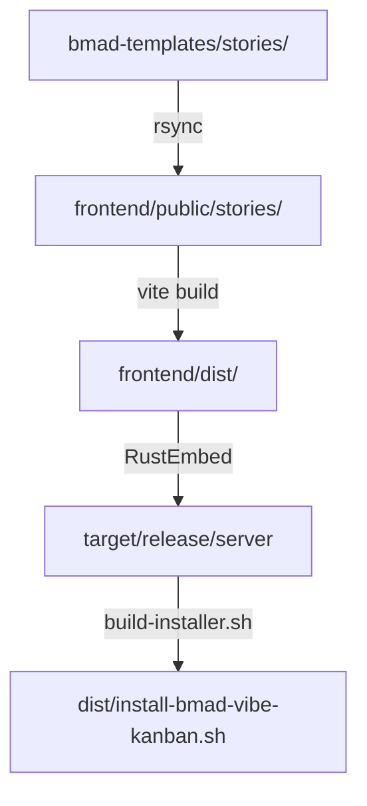

# BMAD-Vibe-Kanban Documentation Index

Complete documentation for the BMAD-Vibe-Kanban project - a fork of Vibe Kanban 0.1.4 with integrated BMAD methodology.

## Quick Start

- **[README.md](./README.md)** - Project overview, quick start guide, and license information

## Build & Deployment

### Build Guides
- **[docs/BUILD-GUIDE.md](./docs/BUILD-GUIDE.md)** - Complete build documentation
  - Story sync workflow
  - Frontend and backend build process
  - Installer creation
  - Troubleshooting guide
  - CI/CD integration examples

### Testing & Verification
- **[docs/TESTING-CHECKLIST.md](./docs/TESTING-CHECKLIST.md)** - Complete testing guide (6 phases)
- **[docs/BUILD-WORKFLOW-TEST-REPORT.md](./docs/BUILD-WORKFLOW-TEST-REPORT.md)** - Build workflow validation results
- **[docs/IMPORT-VERIFICATION.md](./docs/IMPORT-VERIFICATION.md)** - Story import functionality verification
- **[docs/INSTALLER-TEST-REPORT.md](./docs/INSTALLER-TEST-REPORT.md)** - Installer testing results
- **[docs/CLAUDE-VERIFICATION-GUIDE.md](./docs/CLAUDE-VERIFICATION-GUIDE.md)** - Quick reference for Claude Code verification sessions

## Architecture & Design

### Vibe Kanban Architecture
- **[docs/architecture.md](./docs/architecture.md)** - Vibe Kanban architecture overview
- **[docs/integration-architecture.md](./docs/integration-architecture.md)** - BMAD-Vibe Kanban integration architecture
- **[docs/component-inventory.md](./docs/component-inventory.md)** - Component inventory and structure
- **[docs/source-tree-analysis.md](./docs/source-tree-analysis.md)** - Source tree analysis

### Technical Specifications
- **[docs/api-contracts.md](./docs/api-contracts.md)** - API contracts and interfaces
- **[docs/data-models.md](./docs/data-models.md)** - Data models and schemas
- **[docs/project-overview.md](./docs/project-overview.md)** - Project technical overview

## Fork & Modifications

- **[docs/FORK.md](./docs/FORK.md)** - Fork relationship with upstream Vibe Kanban
  - Syncing strategy
  - Version numbering
  - Upstream compatibility
- **[docs/fork-history/MODIFICATION_FORK.md](./docs/fork-history/MODIFICATION_FORK.md)** - Detailed modifications made to Vibe Kanban fork
  - Feature additions
  - Code changes
  - Integration points

## BMAD Methodology

### Philosophy & Specifications
- **[bmad-templates/docs/00-BMAD-TEA-MASTER-GUIDE.md](./bmad-templates/docs/00-BMAD-TEA-MASTER-GUIDE.md)** - BMAD methodology master guide
- **[bmad-templates/docs/01-WORKFLOW-PHASES-COMPLETE.md](./bmad-templates/docs/01-WORKFLOW-PHASES-COMPLETE.md)** - Complete workflow phases specification
  - Philosophy of BMAD stories
  - Wave-Epic-Story (WES) structure
  - Workflow execution model
- **[bmad-templates/docs/03-GUIDE-CHOIX-WORKFLOW.md](./bmad-templates/docs/03-GUIDE-CHOIX-WORKFLOW.md)** - Workflow selection guide
- **[bmad-templates/docs/traceability-matrix.md](./bmad-templates/docs/traceability-matrix.md)** - Story traceability matrix

### Story Workflows

BMAD includes 4 pre-built workflows with 39 total stories:

| Workflow | Location | Stories | Purpose |
|----------|----------|---------|---------|
| **workflow-complet** | [bmad-templates/stories/workflow-complet/](./bmad-templates/stories/workflow-complet/) | 18 | Complete product development (ideation → deployment) |
| **document-project** | [bmad-templates/stories/document-project/](./bmad-templates/stories/document-project/) | 10 | Documentation-first approach for existing codebases |
| **quick-flow** | [bmad-templates/stories/quick-flow/](./bmad-templates/stories/quick-flow/) | 4 | Fast feature development workflow |
| **debug** | [bmad-templates/stories/debug/](./bmad-templates/stories/debug/) | 7 | Bug investigation and resolution workflow |

## Development

### Developer Guides
- **[docs/AGENTS.md](./docs/AGENTS.md)** - Development guidelines and build commands
- **[docs/development-guide.md](./docs/development-guide.md)** - Developer guide
  - Development environment setup
  - Local development workflow
  - Debugging tips

### Claude Code Integration
- **[.claude/CLAUDE.md](./.claude/CLAUDE.md)** - Claude Code project instructions
  - Code organization rules
  - Testing requirements
  - Development workflow

### Community
- **[CODE-OF-CONDUCT.md](./CODE-OF-CONDUCT.md)** - Community guidelines

## Project Structure

```
vibe-kanban/
├── README.md                  # Project overview
├── DOCUMENTATION.md           # This file (documentation index)
├── LICENSE                    # Apache 2.0 license
├── CODE-OF-CONDUCT.md         # Community guidelines
│
├── docs/                      # All documentation
│   ├── BUILD-GUIDE.md
│   ├── TESTING-CHECKLIST.md
│   ├── FORK.md
│   ├── AGENTS.md
│   ├── architecture.md
│   ├── integration-architecture.md
│   ├── api-contracts.md
│   ├── data-models.md
│   └── fork-history/
│       └── MODIFICATION_FORK.md
│
├── bmad-templates/            # BMAD framework source
│   ├── stories/               # 39 workflow story templates
│   │   ├── workflow-complet/
│   │   ├── document-project/
│   │   ├── quick-flow/
│   │   └── debug/
│   ├── docs/                  # BMAD methodology docs
│   ├── scripts/               # BMAD build scripts
│   ├── _bmad/                 # BMAD framework
│   └── .claude/               # Claude config
│
├── frontend/                  # Vibe Kanban React app
│   └── public/stories/        # Stories synced from bmad-templates
│
├── crates/                    # Vibe Kanban Rust backend
├── target/release/server      # Compiled binary (after build)
├── dist/                      # Installer artifacts (gitignored)
│
├── _bmad/                     # BMAD framework (root for active use)
├── .claude/                   # Claude Code config (root for active use)
│
├── build-vibe-kanban.sh       # Main build script
├── build-installer.sh         # Installer build script
└── quick-check.sh             # Validation script
```

## Build Workflow



**Key Scripts:**
1. `./build-vibe-kanban.sh` - Syncs stories, builds frontend and backend
2. `./build-installer.sh` - Creates self-extracting installer
3. `./quick-check.sh` - Validates repository state

## Documentation Categories

### By Audience

**For Users:**
- README.md - Getting started
- bmad-templates/docs/03-GUIDE-CHOIX-WORKFLOW.md - Choose the right workflow

**For Developers:**
- docs/BUILD-GUIDE.md - How to build
- docs/AGENTS.md - Development guidelines
- docs/development-guide.md - Development setup

**For Contributors:**
- docs/FORK.md - Fork relationship
- docs/fork-history/MODIFICATION_FORK.md - What we changed
- CODE-OF-CONDUCT.md - Community rules

**For Architects:**
- docs/architecture.md - System architecture
- docs/integration-architecture.md - Integration design
- docs/api-contracts.md - API specifications

### By Phase

**Phase 1: Setup**
1. README.md - Project overview
2. docs/BUILD-GUIDE.md - Build setup
3. bmad-templates/docs/00-BMAD-TEA-MASTER-GUIDE.md - BMAD intro

**Phase 2: Development**
1. docs/AGENTS.md - Development guidelines
2. .claude/CLAUDE.md - Claude integration
3. docs/development-guide.md - Dev workflow

**Phase 3: Testing**
1. docs/TESTING-CHECKLIST.md - Test guide
2. docs/BUILD-WORKFLOW-TEST-REPORT.md - Test results
3. docs/IMPORT-VERIFICATION.md - Import verification

**Phase 4: Deployment**
1. docs/BUILD-GUIDE.md - Build process
2. docs/INSTALLER-TEST-REPORT.md - Installer validation

## Contributing

See [CODE-OF-CONDUCT.md](./CODE-OF-CONDUCT.md) for community guidelines.

## License

Apache License 2.0 - See [LICENSE](./LICENSE) file for details.

## Support

For issues, questions, or contributions, please refer to the documentation above or contact the maintainers.

---

**Last Updated:** 2026-02-15
**Documentation Version:** 1.0.0
